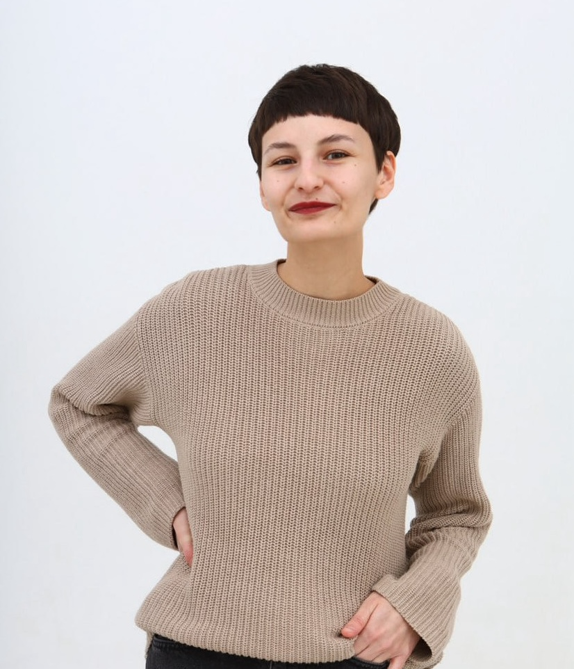

_PhD candidate / Cognitive Neuroscience_  

*Citizen of Armenia, legally residing in Poland as a doctoral student. Eligible to work in Poland without restrictions.*

- **Email:** anna.meliksetian@doctoral.uj.edu.pl
- **OCRID:** [0009-0004-0163-6745](https://orcid.org/0009-0004-0163-6745)  
- **LinkedIn:** [linkedin.com/in/ameliksetian](https://www.linkedin.com/in/ameliksetian/)
 
## About  
PhD candidate in Cognitive Neuroscience with 5+ years of experience in EdTech, instructional design, and learning analytics. Strong track record of creating effective online learning solutions, coordinating educational projects, and mentoring in digital education.

## Education  
- **PhD candidate, Cognitive Neuroscience**  
Jagiellonian University, Poland (2021 – 2026)  

- **MSc, Theoretical and Experimental Psychology** (with honors)  
Lomonosov Moscow State University, Russia (2017 – 2019)

- **BA, Psychology and Pedagogy in Education** (with honors)  
Russian State University for the Humanities, Russia (2013 – 2017)

## Work Experience 

### Foxford – online education platform and LMS system (2019 - 2021)
*Foxford is a large EdTech company and LMS platform with 3.5M registered students and 350K teachers.*

**Metrics Analyst** (2020 – 2021)
- Developed and evaluated performance metrics for the Educational Design and Methodology department.
- Assessed product success metrics for courses created by the department.
  
**Product Administrator** (2020 – 2020)
- Implemented new educational content into the online platform.
- Acted as product manager (training role) for a university entrance exam preparation course.
- Designed and conducted qualitative (custdevs) and quantitative (surveys) research to define product requirements (duration, difficulty, entry level, format).
 
**Methodologist** (2019 – 2020)
- Created course materials, including assignments and assessment tests.
- Supported the customer service team in resolving student and teacher inquiries related to course content.

### Lomonosov Moscow State University (2017 – 2018)
**Assistant: Department of Work Psychology** 
- Assisted in course schedule planning.
- Recorded and prepared documentation of department meetings (methodological discussions, thesis defenses, etc.).

## Volunteering

### Cognition: International Journal of Cognitive Science (2025 – present)
*Cognition is a bimonthly peer-reviewed scientific journal covering cognitive science published by Elsevier.*
**Ad hoc Reviewer**
- Reviewed submitted articles in psycholinguistics, bilingualism, and language processing.

### Social Camp Project (2024 - 2025)
*Social Camp is a project that aims to support informal education and open dialogue in Belarusian society affiliated with Goethe Institute, Warsaw*
**Mentor in the field of EdTech, Social Camp**
- Conducted 10 one-hour mentoring sessions with an early-stage entrepreneur, focusing on educational processes and performance metrics.

## Skills 

#### Programming and web
R (advanced), Python (basic), HTML/CSS (basic).
#### Data analysis
R-Studio, SPSS, JASP.
#### Other tools
GitHub, Jira, Planfix, Notion, Miro, Canva, MS Office.

## Publications  
*Lijewska, Wolna, Durlik, Meliksetian, Sorace, Wodniecka.* **The influence of L2 immersion and L1-reimmersion on reading and grammatical preferences in L1 anaphora**. Bilingualism: Language and Cognition, 2025 (in principle acceptance).

*Meliksetian.* **Formation of grammatical skills in the English language based on the didactic system of Piotr Galperin** (in Russian). Scientific-Methodological Electronic Journal “Concept,” 26, 786–790, 2016, ISSN 2304-120X, [link](https://e-koncept.ru/2016/46958.htm)

*Meliksetian.* **Implementation of philosophical foundations of humane pedagogy on the example of a student project “Epidemic of Mastery”** (in Russian). Scientific-Methodological Electronic Journal “Concept”, 3, 61–65, 2015, ISSN 2304-120X, [link](https://e-koncept.ru/2015/65263.htm)

*Meliksetian.* **Usage of children’s literature as the foundation of an art therapy program with children under state care: a review of experience** (in Russian). Scientific Journal “The Young Scientist”, 22.1, 143–146, 2015, ISSN 2072-0297, [link](https://moluch.ru/archive/102/23234/)

## Languages
- Russian (native speaker)
- Armenian (native spreaker, limited proficiency)
- English (C2)
- Polish (C1)

## Contact  
You can reach me via email (anna.meliksetian@doctoral.uj.edu.pl) or on [LinkedIn](https://linkedin.com/in/ameliksetian).  

## RODO
Wyrażam zgodę na przetwarzanie moich danych osobowych przez Cognizant w celu prowadzenia rekrutacji na aplikowane przeze mnie stanowisko.

Last updated on Sep 13, 2025
